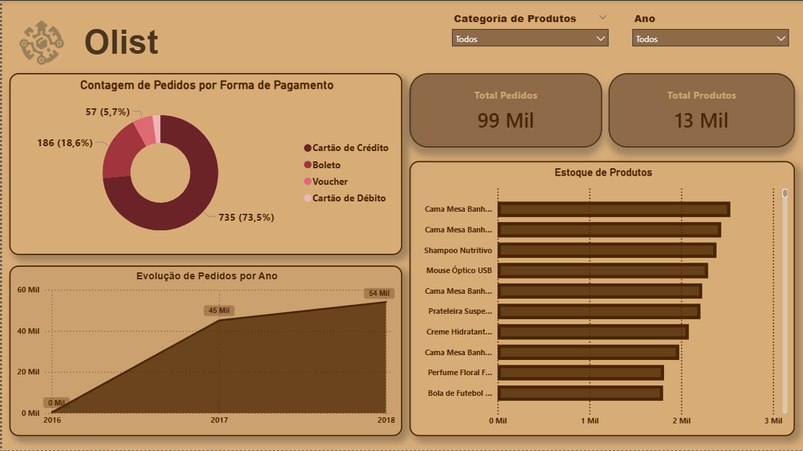

# 📊 Projeto de BI – Análise de E-commerce Olist

## 📌 Visão Geral

Este projeto tem como objetivo realizar uma **análise completa de dados de e-commerce da Olist**, uma loja ficticia criada pelo curso (**Power BI Desktop: realizando ETL no Power Query**), da plataforma **Alura** utilizando **Power BI** para modelagem, tratamento dos dados e criação de dashboards interativos.

O foco principal é transformar dados brutos em **insights estratégicos**, explorando vendas, produtos, clientes, pedidos e desempenho operacional.

O projeto foi estruturado seguindo **boas práticas de BI**, com modelagem adequada, documentação e versionamento via **GitHub**.

---

## 🎯 Objetivos do Projeto

* Analisar o desempenho de vendas do e-commerce
* Avaliar faturamento e quantidade de pedidos
* Explorar dados por categoria de produto
* Criar um dashboard interativo e escalável
* Aplicar boas práticas de modelagem e versionamento (PBIP)

---

## 🗂️ Estrutura do Repositório

```text
📁 projeto-olist-powerbi
 ├── 📁 data
 │    ├── olist_produtos.csv
 │    ├── olist_pedidos.csv
 │    ├── olist_itens_pedidos.csv
 │    └── olist_clientes.csv
 │
 ├── 📁 OlistDashboard.Report
 ├── 📁 OlistDashboard.SemanticModel
 ├── OlistDefinitive.pbip
 │
 └── README.md
```

---

## 🧠 Modelagem de Dados

O modelo foi construído seguindo o conceito de **modelo estrela**, separando:

* **Tabelas fato**: pedidos, itens de pedidos
* **Tabelas dimensão**: produtos, categorias

### 🔹 Destaque da Modelagem

Durante o desenvolvimento, foi identificada uma oportunidade de melhoria na base original:

> A base não possuía o **nome do produto diretamente relacionado ao ID do produto**.

🔧 **Solução aplicada**:

* Criação da coluna `nome_produto` na tabela `olist_produtos`
* Relacionamento direto entre produtos e itens de pedido

Essa melhoria permitiu análises mais precisas, como:

* Quantidade de produtos distintos
* Estoque e performance por produto

---

## ⚙️ Tratamento dos Dados (ETL)

O processo de ETL foi realizado no **Power Query**, incluindo:

* Limpeza de dados
* Padronização de colunas
* Criação de colunas calculadas
* Ajuste de tipos de dados
* Uso de parâmetros

📌 Exemplo de caminho relativo utilizado:

## 📊 Dashboard

O dashboard foi construído no **Power BI Desktop**, contendo:

* Formas de Pagamento mais utilizadas
* Evolução de Pedidos entre os anos de 2016, 2017 e 2018
* Estoque de Produtos por ano
* Total de Pedidos e Produtos
* Filtragem por Categoria de Produtos e Ano

📷 *Preview do dashboard:*



---

## 🧩 Tecnologias Utilizadas

* Power BI Desktop
* Power BI Project (.pbip)
* Power Query (M)
* Git & GitHub
* Base de dados do curso (**Power BI Desktop: realizando ETL no Power Query**) da plataforma ( **Alura** )

---

## 🚀 Como Executar o Projeto

1. Clone o repositório:

```bash
git clone https://github.com/seu-usuario/projeto-olist-powerbi.git
```

2. Abra o arquivo:

```text
OlistDashboard.pbip
```

3. Certifique-se de que a pasta `data` está no mesmo nível do projeto
4. Atualize os dados no Power BI

---

## 🔒 Observações Importantes

* Os dados utilizados são **públicos e educacionais**
* Não há informações sensíveis

---

## 👨‍💻 Autor

Projeto desenvolvido por **[Davi Estevam Silva]**
Foco em **Business Intelligence, Análise de Dados e Power BI**.

📎 Este projeto faz parte do meu **portfólio profissional**.

---

## ⭐ Contribuições

Sugestões e melhorias são bem-vindas!
Sinta-se à vontade para abrir uma *issue* ou *pull request*.

---

**Se este projeto foi útil, deixe uma ⭐ no repositório!**


